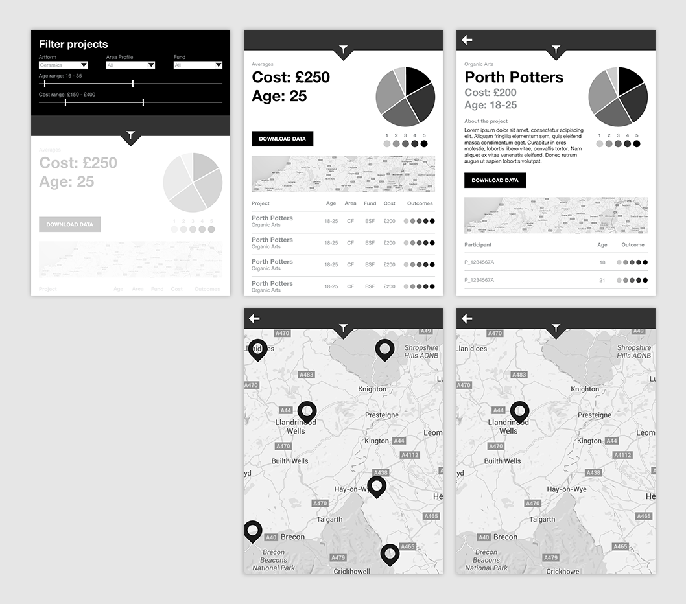

#Arts Impact Data (Wales) Technical Specification

The purpose of this repo is to document the technical solution for the Arts Impact Data project. This phase of the project seeks to validate the hypothesis that _an Open Data model can be developed that can portray the performance of community arts projects_. To do this, the solution needs to:

* Allow for easy upload of project and participant data by community arts organisations and public agencies
* Allow for the uploaded data to be shared, both via an API and through more traditional means (e.g. CSV)

Ultimately, the platform needs to provide a reporting and analysis web application for both artists and funders to be able to query this data to develop insight into where money should be spent, however, that is largely beyond the scope of this project.

This repo documents the solution based on three core phases.

##Phases

Each phase below builds on the one that came before it; however, each phase provides a solution to the problem of "how to store and report arts impact data" in its own right. The solutions:

###[Phase 1 – Prototype using off the shelf services](phases/1-prototype-off-the-shelf.md)

Build a prototype of the data model using AirTable to allow for quick iterations of the model. 

###[Phase 2 – Build a platform to serve the data model](phases/2-platform.md)

Build a platform to serve the data model developed in Phase 1 and serve [REST/JSON API](https://en.wikipedia.org/wiki/Representational_state_transfer) – with manual data entry by a system administrator.

###[Phase 3 – Adds input form and "my data" portal](phases/3-input-form.md)

Takes Phase 2 and adds an easy-to-use front-end form so that individual arts projects can upload their own data. Also adds a "my data" portal so that arts organisations can manage their own data

###[Phase 4 – Application hack day/workshop](phases/4-hack-day.md)

This project exists to prove if the data model works. It will be best proved if:

* Funders can see the use of the outputs
* Artists can see how their inputs turn into outputs
* Developers can understand what the artists and funders would like to get out of the data

As a result, we're proposing organising a hack day/workshop that will bring together these three groups to build and specify a prototype for a future reporting and analysis web app.

###Further development

Although out of scope for this project, the wireframes below represent the eventual goal of this platform – an easy-to-use tool for artists and funders to understand the efficacy of community arts projects.

[A click-through-able version of these wireframes is available here](http://adobe.ly/1VKE2OX)

##Solution assumptions

The following assumptions apply to all phases:

* **Each project has a single outcome/objective**. Although we recognise that projects may have multiple objectives, this solution assumes that they have a primary objective against which their success can be measured (e.g. *reduction in unemployment*, *improved life satisfaction*, *reduced obesity* etc.). This assumption is critical as it allows a vastly simplified data model that doesn't depend on the data model describing every permutation and combination of objectives. This is easier to explain if we give a counter-example: if a project has multiple objectives, there's no way to conclusively establish a relationship between the outcomes (e.g. 70% of participants showed an improvement in their life satisfaction) and the cost per head of the project

##Implementation cost

Each proposed phase includes an estimated number of person-days of tech budget to implement that phase. These should be taken lightly as the functional spec for later phases will likely be influenced by the outcome of earlier phases.

Activity | Estimated days
--- | ---
Phase 1 – Prototype | 8
Phase 2 – Platform | 20
Phase 3 – Input form and API | 29
Phase 3 – Hack day | 6
**Total** | **63 days**

##Ongoing hosting and technical support
The solution will need hosting (its own virtual server) and technical support. The project should budget at least £50/month for this on an ongoing basis.