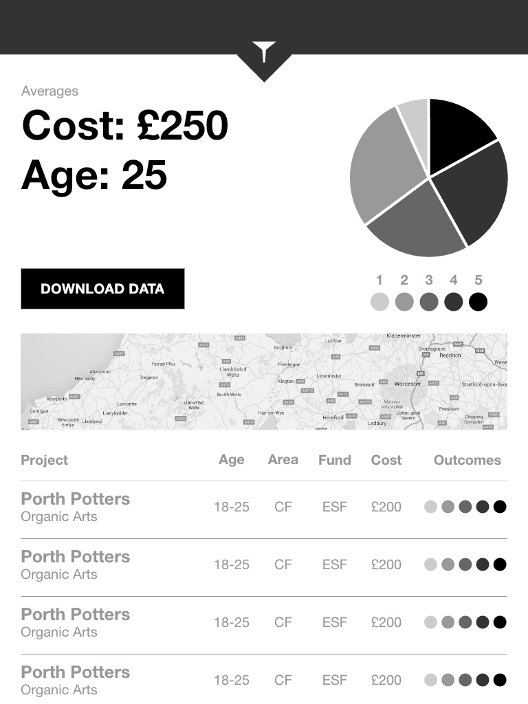
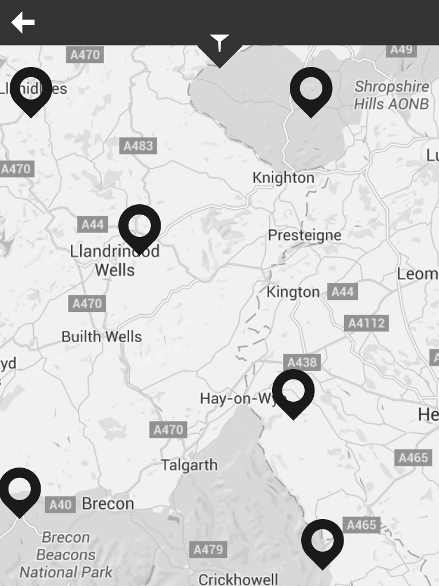

#Wireframes

We have created a number of mocked-up views.

[A click-through-able version is available here](http://adobe.ly/1VKE2OX)

##main-query.png

This is a standard query view with aggregate figures displayed at the top of the screen a download data button and a list of projects included in the query.

##query-filters.png

This shows the filters available to customise the query.

##query-map.png

Projects included in a given query can be displayed on a map.

##single-project.png

Clicking either a row in the projects table or a pin on the query map takes you to a single project view. Here you can see aggregate figures for that project followed by a list of participants.

##single-project-map.png

An individual project can also be viewed on a map.

